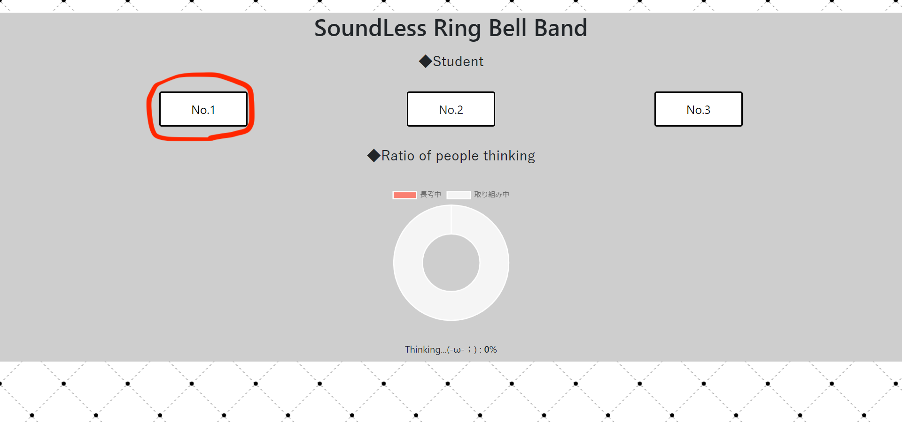
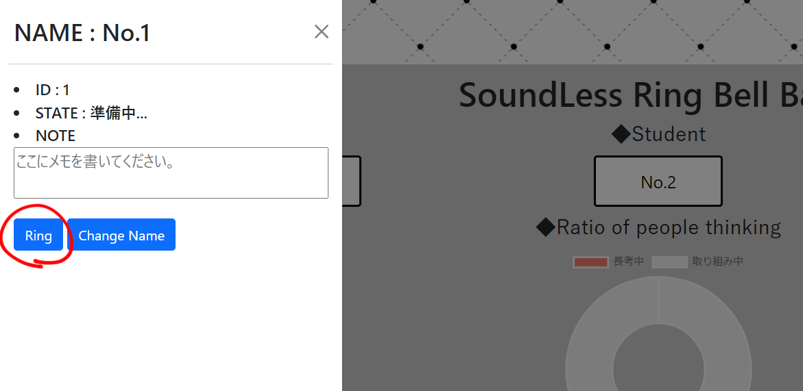
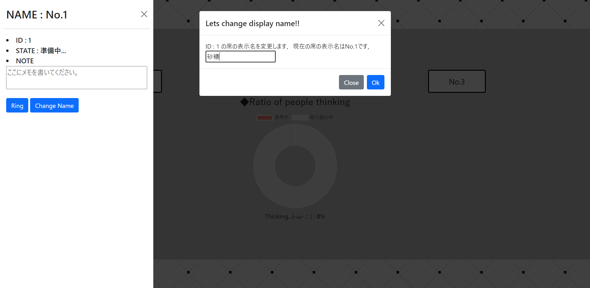

# SoundLess Bell Band ～音の鳴らない呼び鈴バンド～

## ■本製品の概要
本製品は授業中の演習問題をしている最中に問題が分からない生徒を検知して，少人数なら個別指導をする人対して，先生が選択してその人に通知する．また過半数の人分からない状況のときは自動的にその人たちに一斉通知をして，先生が全体でもう一度授業の復習をするようにする．
通知方法は音や光よりも周りに悟られず，場所にとらわれない振動で通知する．ペンに本製品のバンドをつけることによりそれが振動して，生徒に瞬時に伝えることができる．
また，先生側ではPCで生徒の状況を把握でき，問題が終わっている生徒や問題に取り組んでいる生徒などをステータスで把握でき，それの全体の割合などをグラフなどで可視化できる．
## ■操作説明  
ペンが止まったことを加速度センサーが検知すると，先生側の画面でペンの名前が書かれたボックスが赤く表示される(赤丸のところが赤く表示)．また，下の円グラフの表示も割合によって変化する．  
  

個別指導を行う生徒に通知するためには，赤く表示されているボックスをクリックし，左側に表示されたメニューにある「Ring」をクリックする．  
  

表示されている名前を変えることもできる．その際には，左側に表示されたメニューにある「Change Name」をクリックする．変更後の名前をボックスに入力する．  
  

### ・秘匿モードについて
ペンの状況が先生側に見えなくなり，振動の通知が来ない．  
じっくり考えたいときなどに使う．  
ベルトに取り付けられたスイッチを押すと秘匿モードが発動し，もう一度押すと解除される．秘匿モード発動時には，ライトが1回点滅し，解除時には，ライトが3回点滅する．


## ■各部の説明（ハードウェア）
### ペンバンド
#### 操作
- タクトスイッチ…秘匿モードのon/off
- LEDライト…タクトスイッチ操作時の通知
#### 機能
- 振動モータ
- 加速度センサ
  

### ペン立て
- 簡易スイッチ（ペンを置くとON）…演習完了を検知

## ■ディレクトリ構成
以下に簡単な説明を載せる．
```
/
├ pc.html : 管理者側のhtml．
├ pc.css : 管理者側のcss．
| pen.html : 生徒側のhtml.
├ components/ : jsの関数は以下に置くこと．
| ├ pc/ : pc側のコンポーネント．
| | ├ ConnectServer.js : サーバー(achex)に接続する．
| | ├ DrawingCharts.js : 長考中と取り組み中の割合を示す円グラフの表示．
| | ├ Pc.js : pc.htmlが参照するpcで使うコンポーネントを束ねる．
| | ├ ReceivePc.js : pc.jsにインポートできるように受信系のコンポーネントを束ねる．
| | ├ SendPc.js :  pc.jsにインポートできるように送信系のコンポーネントを束ねる．
| | ├ receive/ :通信データを受け取り実行するコンポーネント．
| | | └ SeatJudge.js : 状態(state)をRPi側から受け取り，そのような状態にGUI上のボタンの色などを変更する．
| | └ send/ :通信データとしてセンサの情報などを送信するコンポーネントを束ねる．
| |   ├ ChangeName.js : 名前を変更するところを作る．
| |   ├ Onlight.js : ライトを光らせるためにRPi側に情報を渡す．
| |   └ OnVibration.js :手動ボタンでバイブレーションを光らせるためにRPi側に情報を渡す．また，閾値以上に他の生徒のペンが止まっていると全員に通知するルーチンもここでおこなう．
| └ rpi/
|  ├ ConnectServer.js : サーバー(achex)に接続する．
|  ├ RPi.js : pen.htmlが参照するRPiで使うコンポーネントを束ねる．
|  ├ ReceiveRPi.js : RPi.jsにインポートできるように受信系のコンポーネントを束ねる．
|  └ SendRPi.js : RPi.jsにインポートできるように送信系のコンポーネントを束ねる
|   ├ receive/ : 通信データを受け取り実行するコンポーネント．
|   | ├ LightVibration.js : 受け取ったメッセージがライトかバイブレーションだったらポートを開いて動かす．
|   | └ ReflectName.js : メッセージで変更した名前をうけとり，pen.htmlのNAMEにも反映される．
|   └ receive/ :通信データを受け取り実行する．
|     ├ Accelerator.js : 加速度センサでペンが止まっているか判断して結果をpc側に送信する．
|     ├ StandSwitch.js : ペン立ての底にあるスイッチを押して状態を"完了"にする．
|     └ TactSwitch.js : "秘匿モード"の解除，接続できるタクトスイッチの情報を投げる．
├ README.md : マニュアル．
└ readme/ : readmeで使う画像フォルダ．
```

## ■使用ライブラリ・素材
- bootostrap : https://getbootstrap.jp/
- Chart.js : https://misc.0o0o.org/chartjs-doc-ja/
- CHIRIMEN : https://tutorial.chirimen.org/
- relayServer.js : https://chirimen.org/remote-connection/

## ■免責
生じた如何なる損害や修正や更新も責任を負いません．
使用する際は自己責任でお願いします．

## ■著作権について
Copyright (C) 2021 KakeruKitahara

一連のソースコードを，個人的な利用以外に使用することを禁止します．

## ■製作について
本リポジトリは4日間という期間の中で，Web言語を用いてIoT製品を目標のもと，主にraspberry piとJavaScriptを用いて作成しました．
### ■工夫した点
- 様々なペンにも対応できる​ようにバンドにした．
- グラフによる可視化​．
- ペン側に自身の状況を先生側から見ることができない秘匿モードを追加で作成した．
### ■改善点
- バンドやペン立てがラズパイに有線で繋がれているので，それを無線にする．
- データをキャッシュに保存する．
- 生徒の数の変更を簡単にする．
- PHPやejsなどでhtmlのコードを簡単化させる．

## ■更新情報
```
v1.1
・[update] 管理者側(pc.html)のGUIの改良．
・開発終了

v1.0
・公開
```

